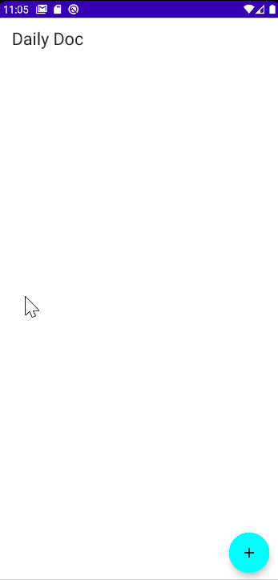
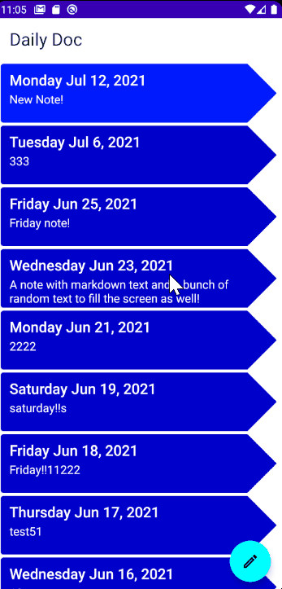

# DailyDoc
**Productivity Note App utilizing Jetpack Compose**

***Working with another developer to build mocks to rebuild the design for Daily Doc! Current design only showcases current app functionality***

First project - Feedback welcomed! 

Daily Doc is a productivity app to help you keep track of your daily progress inspired by 100-day-challenges.

Direct Download: [Daily Doc](https://drive.google.com/file/d/1QNgtfXcrYIcCSJWijaeHScoawmNUNh6e/view?usp=sharing)

--------------------------------------
  
Server connects to my Ktor server & MongoDb, so will not function properly if you do not set it up.

Install the Ktor server at [Ktor Daily Doc Server](https://github.com/B-Lidberg/ktor-daily-doc)

Google Login is currently disabled. Also, since the server only works locally, I have not added
encryption.

Discussion open - feel free to communicate through it as well if you're interested in a feature you would like for me to implement!

--------------------------------------
<kbd></kbd> <kbd></kbd>

-------------------------------------
**Currently working on implementing:**
- New UI/UX Design for entire app!

**Upcoming features:**
- Friends list
- Cloud server instead of running on localhost

------------------------------------------
MADSCORE: https://madscorecard.withgoogle.com/scorecard/share/416599438/
------------------------------------------
**Other ways to contact me:**
- LinkedIn: https://www.linkedin.com/in/bryan-lidberg-84b24a208/
- Twitter: https://twitter.com/Lidberg_B
- Slack: https://kotlinlang.slack.com/team/U01P1VA0DC4
