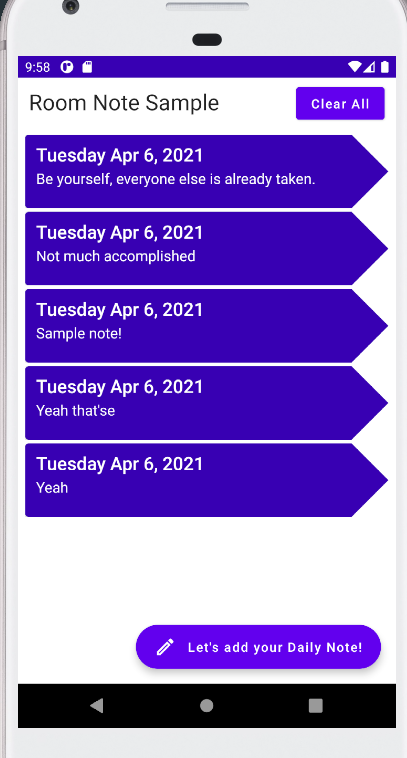
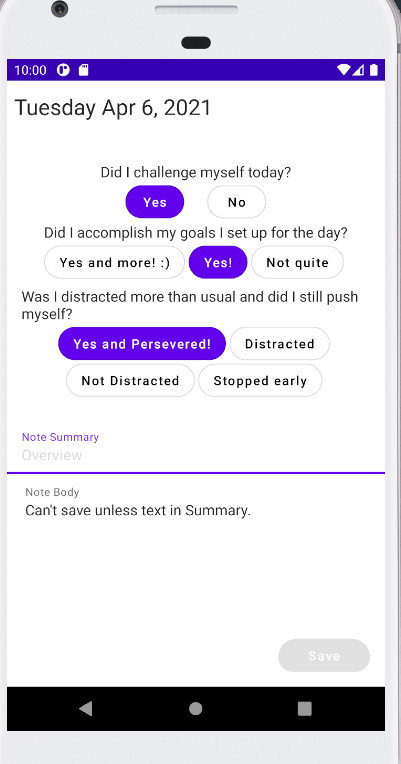
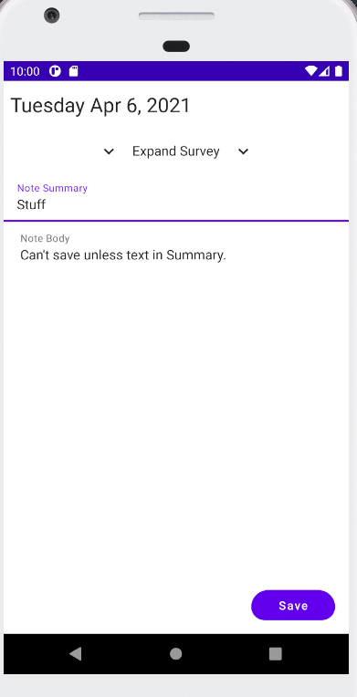
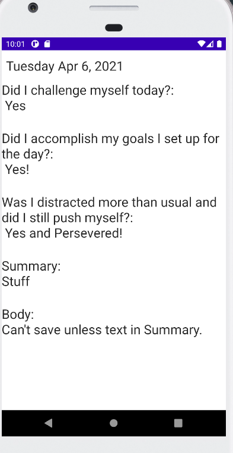

# DailyDoc
**Productivity Note App utilizing Jetpack Compose**

First project - Feedback welcomed! 

Currently a simple note taking app that stores notes locally. 
*(Screenshots are currently outdated)*
 
 

**Few features I'll be adding:**
- Login Screen
- Remote Database
- Profile Settings
- ~~Limit 1 note per day (can be edited on same day but restricted editing after)~~
- Improved UI
- Animations
- ~~Remove "Clear All" Button. Currently there~~
- Search features: Date, text in Summary/Body, by survey answers
------------------------------------------
**Other ways to contact me:**
- Twitter: https://twitter.com/Lidberg_B
- Slack: https://kotlinlang.slack.com/team/U01P1VA0DC4
