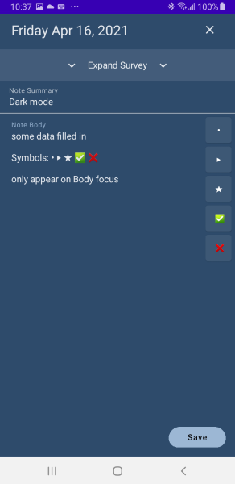

# DailyDoc
**Productivity Note App utilizing Jetpack Compose**

First project - Feedback welcomed! 

Daily Doc is a productivity app to help you keep track of your daily progress.

Direct Download: [Daily Doc](https://drive.google.com/file/d/1QNgtfXcrYIcCSJWijaeHScoawmNUNh6e/view?usp=sharing)

There is a branch without Hilt (pre-hilt) if you're interested, but it will no longer be updated unless asked to.

**Most Recent Features Added**
- Drawer Navigation for Login & Account Screens (*Screenshots not update*)

**Other Recent Features Added**
- Login feature with google sign in
- Splash Screen
- Symbols available when editing body
--------------------------------------
<kbd></kbd> <kbd></kbd>
<kbd></kbd><kbd></kbd>
<kbd></kbd><kbd></kbd>
<kbd></kbd><kbd></kbd>
-------------------------------------
**Few features I'll be adding:**
- ~~Login Screen~~ ✅
- Remote Database
- Profile Settings
- ~~Limit 1 note per day (can be edited on same day but restricted editing after)~~ ✅
- Improved UI
- Animations
- ~~Remove "Clear All" Button. Currently there~~ ✅
- Search features: Date, text in Summary/Body, by survey answers
------------------------------------------
**Other ways to contact me:**
- Twitter: https://twitter.com/Lidberg_B
- Slack: https://kotlinlang.slack.com/team/U01P1VA0DC4
